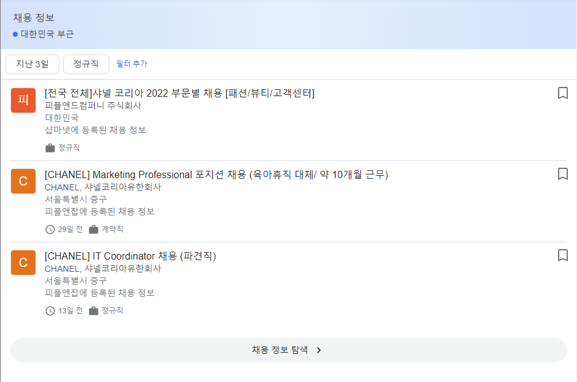

# Job search
- 해당 페이지는 더 이상 사용되지 않습니다. [Confluence](https://ascentkorea.atlassian.net/wiki/spaces/CJHZ/pages/397606925/Features)를 참고해 주세요!
[HTML](https://ascentkorea-docs.github.io/mobile/features/job\_search/sample.html) [JSON](https://ascentkorea-docs.github.io/mobile/features/job\_search/sample.json)



```
{
    "sequence": 1,
    "type": "job_search",
    "_selector": "div:nth-child(2)#cnt > div:nth-child(8)#center_col.center_col.s6JM6d > div:nth-child(4) > div:nth-child(2)#rso > div:nth-child(1).MjjYud > div:nth-child(1) > div:nth-child(1) > g-card.cvoI5e",
    "title": "채용 정보",
    "location": "대한민국 부근",
    "refinements": [
        {
            "text": "지난 3일",
            "_selector": "div:nth-child(2)#cnt > div:nth-child(8)#center_col.center_col.s6JM6d > div:nth-child(4) > div:nth-child(2)#rso > div:nth-child(1).MjjYud > div:nth-child(1) > div:nth-child(1) > g-card.cvoI5e > div:nth-child(1).mnr-c > div:nth-child(1) > div:nth-child(1) > div:nth-child(1).nJXhWc > div:nth-child(2) > div:nth-child(1).J7eW > div:nth-child(2).CcgH5c > g-scrolling-carousel > div:nth-child(1).mR2gOd > div:nth-child(1).EDblX.DAVP1 > div:nth-child(1).B8XQWe"
        },
        {
            "text": "정규직",
            "_selector": "div:nth-child(2)#cnt > div:nth-child(8)#center_col.center_col.s6JM6d > div:nth-child(4) > div:nth-child(2)#rso > div:nth-child(1).MjjYud > div:nth-child(1) > div:nth-child(1) > g-card.cvoI5e > div:nth-child(1).mnr-c > div:nth-child(1) > div:nth-child(1) > div:nth-child(1).nJXhWc > div:nth-child(2) > div:nth-child(1).J7eW > div:nth-child(2).CcgH5c > g-scrolling-carousel > div:nth-child(1).mR2gOd > div:nth-child(1).EDblX.DAVP1 > div:nth-child(2).B8XQWe"
        }
    ],
    "items": [
        {
            "title": "[전국 전체]샤넬 코리아 2022 부문별 채용 [패션/뷰티/고객센터]",
            "_selector": "g-card.cvoI5e > div:nth-child(1).mnr-c > div:nth-child(1) > div:nth-child(1) > div:nth-child(1).nJXhWc > ul > li:nth-child(1).iFjolb.gws-plugins-horizon-jobs__li-ed",
            "company": "피플앤드컴퍼니 주식회사",
            "location": "대한민국",
            "via": "샵마넷에 등록된 채용 정보"
        },
        {
            "title": "[CHANEL] Marketing Professional 포지션 채용 (육아휴직 대체/ 약 10개월 근무)",
            "_selector": "g-card.cvoI5e > div:nth-child(1).mnr-c > div:nth-child(1) > div:nth-child(1) > div:nth-child(1).nJXhWc > ul > li:nth-child(3).iFjolb.gws-plugins-horizon-jobs__li-ed",
            "company": "CHANEL, 샤넬코리아유한회사",
            "location": "서울특별시 중구",
            "via": "피플앤잡에 등록된 채용 정보"
        },
        {
            "title": "[CHANEL] IT Coordinator 채용 (파견직)",
            "_selector": "g-card.cvoI5e > div:nth-child(1).mnr-c > div:nth-child(1) > div:nth-child(1) > div:nth-child(1).nJXhWc > ul > li:nth-child(5).iFjolb.gws-plugins-horizon-jobs__li-ed",
            "company": "CHANEL, 샤넬코리아유한회사",
            "location": "서울특별시 중구",
            "via": "피플앤잡에 등록된 채용 정보"
        }
    ]
}
```
