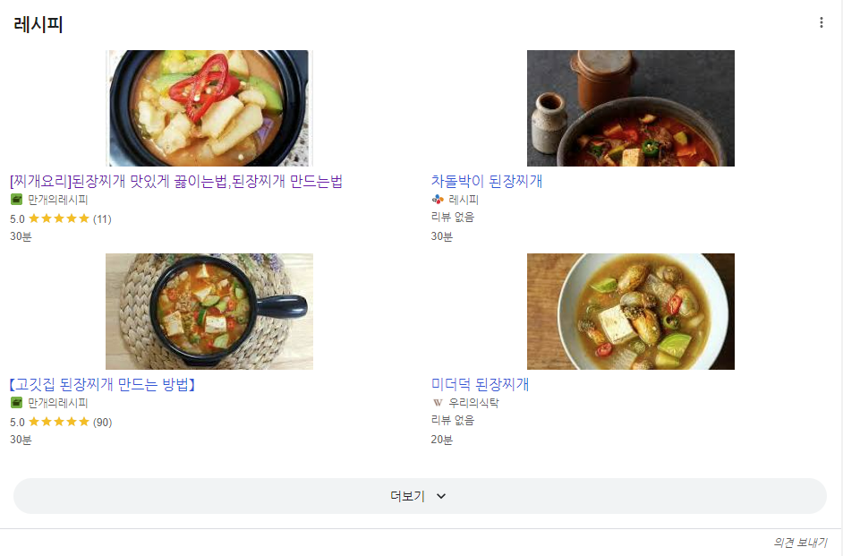

# Recipes
- 해당 페이지는 더 이상 사용되지 않습니다. [Confluence](https://ascentkorea.atlassian.net/wiki/spaces/CJHZ/pages/397606925/Features)를 참고해 주세요!
[HTML](https://ascentkorea-docs.github.io/mobile/features/recipes/sample.html) [JSON](https://ascentkorea-docs.github.io/mobile/features/recipes/sample.json)



```
{
    "sequence": 4,
    "type": "recipes",
    "title": "레시피",
    "grid": {
        "items": [
            {
                "title": "[찌개요리]된장찌개 맛있게 끓이는법,된장찌개 만드는법",
                "source": "만개의레시피",
                "rating": {
                    "rating_value": "5.0",
                    "rating_count": "(11)"
                },
                "time": "30분",
                "url": "https://www.10000recipe.com/recipe/6850626"
            },
            {
                "title": "차돌박이 된장찌개",
                "source": "레시피",
                "time": "30분",
                "url": "https://www.cj.co.kr/kr/k-food-life/cj-the-kitchen/recipe/0000002053"
            },
            {
                "title": "【고깃집 된장찌개 만드는 방법】",
                "source": "만개의레시피",
                "rating": {
                    "rating_value": "5.0",
                    "rating_count": "(90)"
                },
                "time": "30분",
                "url": "https://www.10000recipe.com/recipe/6867859"
            },
            {
                "title": "미더덕 된장찌개",
                "source": "우리의식탁",
                "time": "20분",
                "url": "https://wtable.co.kr/recipes/KfUMpr2n92YwXP1xGebVKeWN"
            }
        ]
    }
}
```